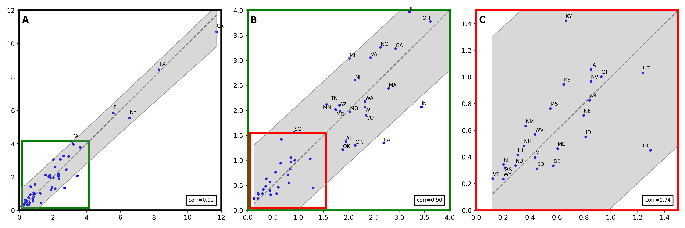

# <div align="center">**280 Characters to Employment**</div>
## <div align="center">**Using Twitter to Quantify Job Vacancies**</div>

## Table of Contents
- [Paper Summary](#paper-summary)
- [Repository Contents](#repository-contents)
- [Inference Pipeline](#inference-pipeline)
- [Input Files Format](#input-files-format)
- [AR Models](#ar-models)
- [Representativeness of Twitter Job Opening Index](#representativeness-of-twitter-job-opening-index)
- [Environment Setup](#environment-setup)
- [Code Availability Statement](#code-availability-statement)
- [How to Cite](#how-to-cite)
- [License](#license)
- [Contact](#contact)
___
## Paper Summary
This paper investigates the potential of social media, specifically Twitter, to provide a complementary signal for estimating labor market demand. We introduce a statistical approach for extracting information about the location and occupation advertised in job vacancies posted on Twitter. We construct an aggregate index of labor market demand by occupational class in every major U.S. city from 2015 to 2022 and evaluate it against official statistics and an index from a large aggregator of online job postings. The findings suggest that the Twitter-based index is strongly correlated with official statistics and can improve the prediction of official statistics across occupations and states.
___
## Repository Contents
- `ar_models`: Directory containing scripts to perform AR on Twitter Index. More information under [`AR Models`](#ar-models) section.
- `data`: Directory containing the datasets used in the study, with aggregate state and occupation data for replication purposes.
  -  `analyze_tweets` post inference CSV's and figures.
  -  `csv`: Employment data, job titles and location information.
  -  `job_offer`: Official data to compare Twitter index to.
  -  `scripts`: Scripts used to build the files for inference, as well as later analysis of the index.
- `job_title_classifier`: Source code directory with scripts for training Job Title classifier with different variations.
- `ner_model`: Source code directory with scripts for training NER model.
- `pipeline`: Source code directory with scripts for our index inference.
___
## Inference Pipeline
The inference process involves a series of scripts executed in the following order:

1. **Preparation**: The [`build_job_offer.py`](data/scripts/build_job_offer.py) script (located under [`data/scripts`](data/scripts)) takes the initial input file and prepares the data for the inference process.
2. **Deduplication**: The [`dedup.py`](data/scripts/dedup.py) script (also under [`data/scripts`](data/scripts)) deduplicates the data to ensure unique job postings are processed.
3. **Inference**: The [`pipeline_single.py`](pipeline/pipeline_single.py) script (located under [`pipeline`](pipeline)) performs the inference using the prepared data.
4. **Post-Inference Processing**: The [`post_predict.py`](pipeline/post_predict.py) script (also under [`pipeline`](pipeline)) processes the output of the inference to generate the final results.

This can be easily triggered using [`run_pipeline.sh`](run_pipeline.sh) script.
### Input Files Format

#### For inference Process
The inference process works on input files with the following columns:
- `user_id`: The id of the user.
- `tweet_timestamp`: The timestamp of the tweet.
- `tweet_text`: The text content of the tweet.
- `tweet_urls`: URLs included in the tweet.

#### For NER Model Training
To train the Named Entity Recognition (NER) model, an input file with the following columns is required:
- `Text` - The text of the tweet.
- `Token` - The word that was being tagged.
- `ORG` - 1 or 0 to mark if the token is an organization.
- `LOC` - Same only for location
- `JOB_TITLE` - Same to mark a job title.
- `MISC` - Everything that doesn't fall under the previous categories.
You can train the model using the [`main.py`](ner_model/main.py) (located under [`ner_model`](ner_model)).

#### For Job Title classifier Training
To train you own `Job Title Classifier` you can use the provided [`job_titles.csv`](data/csv/job_titles.csv).
You can suse the provided [`train_bert.py`](job_title_classifier/train_bert.py) script (located under [`job_title_classifier`](job_title_classifier)).

### AR models
#### Input file
The input file for the AR model is created during the **post inference** process called [`merged_regression_ready.csv`](pipeline/csv/merged_regression_ready.csv) (located under [`pipeline/csv`](pipeline/csv)).
It contains the following columns:
- `date` - Date in a monthly granularity (01/12/2016, 01/01/2017, 01/02/2017, ...).
- `state_name` - The name of the state.
- `occupation_name` - The name of the occupation (Assemblers, Cleaners and helpers, ...).
- `job_offer` - # of job offers found in our index.
- `employment` - Employment rates from the Current Population Survey (CPS).
- `job_offer_rate` - A normalized number of job-opening tweets by the total number of tweets posted in the state in a given time period.
- `employment_rate` - A normalized rate of employment by the total number of employment in the state in a given time period.
- `job_offer_rate_overall` - A normalized number of job-opening tweets by the total number of tweets in a given time period.
- `employment_rate_overall` - A normalized rate of employment by the total number of employment in a given time period.

#### Time series prediction
To perform the time series prediction of employment rated you can simply use [`pooled_effects.py`](ar_models/pooled_effects.py) (located under [`ar_models`](ar_models)) to train the Auto Regressive (AR) models per state.

#### Heat Map Plot
Finally, we can run [`plot_rmse.py`](ar_models/plot_rmse.py) to re-create the prediction gain heatmap [`Fig. 6`](rmse_heatmap.png) plot from the paper.
___
## Representativeness of Twitter Job Opening Index
### Input files
The input files for the `Representativeness of Twitter Job Opening Index` are as follows:
- `pipeline/csv/merged/` - This will be created during the **inference** process. it will contain monthly CSV's which will hold the index data.
- [`data/job_offer/`](data/job_offer) - In the folder you will find files with URL's leading to the data. You can download and parse the data using them. The data itself is not shared as it is not ours to share. Please feel free to reach us if you are facing issues.

### Twitter index analysis
First you will need to run [`aggragate_tweets.ipynb`](data/scripts/aggragate_tweets.ipynb) (located under [`data/scripts`](data/scripts)).
This will create [`analyze_tweets`](data/analyze_tweets) folder under [`data`](data) and create the required files for the analysis.
Next you can run [`analyze_tweets.ipynb`](data/scripts/analyze_tweets.ipynb) to re-create [`Fig. 4`](data/analyze_tweets/figs/state_twitter_jolt_monthly_state_normalized_line.png) and [`Fig. 5`](data/analyze_tweets/figs/us_twitter_bgt_emp_yearly_year_line.png) from the paper. 
___
## Environment Setup

Before running the scripts, you need to set up your Python environment:

1. Ensure you have `Python 3.7` installed on your system.
2. Install the required dependencies by running the following command in your terminal:
```
pip install -r requirements.txt
```
The [`requirements.txt`](requirements.txt) file contains all the necessary Python packages to run the code in this repository.
3. Before running the inference using the [`run_pipeline.sh`](run_pipeline.sh) script, please modify and put **your** environment name in the batch files under [`batch_files`](batch_files).
___
## Code Availability Statement
The code used in this study and provided here includes the methodology for accurately extracting occupation and location information from job postings on social media and scripts for evaluating the coverage and representativeness of the Twitter-based job vacancy index.
As Twitter information cannot be shared it is not included here.
___
## How to Cite
Please refer to the ICWSM page for citation details and to access the full paper.
___
## License
The assets in this repository are subject to their respective licenses. Usage complies with the requirements set forth by the data providers.
___
## Contact
For inquiries regarding the paper or the repository, please contact the authors at the following email addresses:
- Boris Sobol Portnov: boris.sobol@gmail.com
- Manuel Tonneau: manuel.tonneau@oii.ox.ac.uk
- Do Lee: dq1204@nyu.edu
- Samuel Fraiberger: sfraiberger@worldbank.org
- Nir Grinberg: nirgrn@bgu.ac.il
